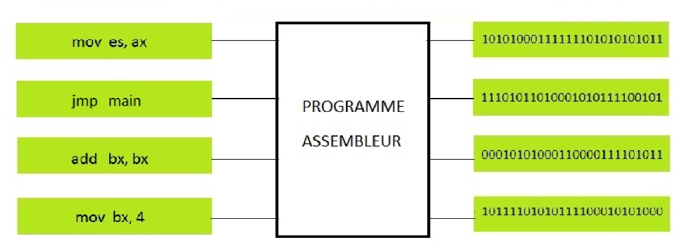

## Assembleur, assembly, nasm, opcodes

- L'assembly est un language
- L'assembler c'est le programme qui va comprendre l'assembly et le convertir en opcode qui pourront etre lut par le CPU
- Nasm est un assembler pour l'architecture intel x64




## Bonjour monde !
Il était une fois le hello world (avant de commencer la théorie qui fait mal à la tête)

```assembly
section .data
    msg db "Bonjour, monde !", 10
    len equ 17

section .text
    global _start

_start:
    mov rax, 1
    mov rdi, 1
    mov rsi, msg
    mov rdx, len
    syscall

    mov rax, 60
    xor rdi, rdi
    syscall
```
```
nasm -f elf64 coucou.asm ; ld coucou.o -o coucou ; ./coucou
```
#### La version expliqué :
```assembly
section .data ; declare la section mémoire des données initialisées

    ; place dans l'adresse mémoire contenant l'étiquette msg les octets (define byte) du message et 10 qui est le numéro ascii du retour à la ligne
    msg db "Bonjour, monde !", 10

    ; la longueur du message dont aura besoin la syswrite
    len equ 17

section .text
    ; section du code, renvoie vers _start
    global _start

_start:
    ; tout cette partie va servir à préparer un syscall et ces arguments
    ; rax	numéro syscall
    ; rdi	argument 1
    ; rsi	argument 2
    ; rdx	argument 3

    mov rax, 1 ; sys_write
    mov rdi, 1 ; file descriptor, 1 = stdout donc on écrit sur l’écran
    mov rsi, msg ; adresse du buffer (l'espace mémoire réservé pour le message)
    mov rdx, len ; nombre d'octet à écrire (ici 17)
    syscall ; demande au kernel Linux d’exécuter sys_write

    mov rax, 60 ; sys_exit
    xor rdi, rdi ; reset rdi à 0
    syscall
```

#### Syscall *under the hood*
Avant le syscall le programme tourne en "ring 3" c'est à dire en userland ; il n'a pas le droit d'accéder directement au matériel sinon ça serais impossible de garantir la stabilité du système. Quand le CPU execute l'instruction syscall il change de privilège (ring 0), charge et saute à une adresse spéciale définie par le kernel.

Le kernel regarde la valeur de rax et il sait que le syscall 1 correspond à sys_write. Il déduit les autres arguments de la fonction via les registres et l'appelle.

#### Schéma complet (généré par chatgpt)
```
Le code (userland, ring 3)
    Préparation des registres
        rax = numéro du syscall (1 = sys_write)
        rdi = argument 1 (fd)
        rsi = argument 2 (buffer)
        rdx = argument 3 (taille)

    Instruction CPU : syscall
        Sauvegarde automatique par le CPU
            RIP utilisateur -> RCX
            RFLAGS -> R11

        Changement de privilège
            Ring 3 -> Ring 0

        Chargement de l'adresse kernel
            registre MSR IA32_LSTAR
            saut vers entry_SYSCALL_64

            Code assembleur du kernel (arch/x86/entry/entry_64.S)
                Sauvegarde des registres utilisateur
                Construction du contexte kernel

                Appel du dispatcher
                    do_syscall_64()

                        Lecture de rax
                            index dans la table des syscalls

                        syscall table
                            sys_call_table[rax]

                                Fonction sys_write()

                                    Sous-système VFS (Virtual File System)
                                        identification du file descriptor

                                        si fd = 1
                                            stdout

                                            TTY subsystem
                                                driver du terminal (tty driver)

                                                    pilote matériel / pseudo-terminal
                                                        buffer du terminal

                                                            terminal emulator
                                                                (bash terminal, gnome-terminal, xterm…)

                                                                    rendu graphique
                                                                        système graphique (Wayland/X11)

                                                                            driver GPU

                                                                                matériel
                                                                                    carte graphique
                                                                                        framebuffer / VRAM
                                                                                            pixels affichés
                                                                                                écran

                Retour du syscall
                    valeur de retour placée dans rax

                Code de sortie syscall
                    restauration des registres

        Instruction CPU : sysret
            restauration du contexte utilisateur
            Ring 0 -> Ring 3

Le programme continue
    instruction suivante après syscall
```

#### assembleur et linker
```
nasm -f elf64 coucou.asm ; le code qui est assemblé en opcodes

ld coucou.o -o coucou ; permet de prendre plain de fichiers object et de les "lier" (linker) ensemble dans un seul programme executable

./coucou ; on lance le programme
```

## Les registres
Registres : emplacement de mémoire processeur. La mémoire la plus rapide de l'ordinateur, mais aussi la plus couteuse à fabriquer en raison de la place limitée disponible dans le CPU.


| 64  | 32   | 16  | 8 (low) | 8 (high) | 
|:----|:----:|:---:|:--------|:---------|
| rax | eax  | ax  | al      | ah       |
| rbx | ebx  | bx  | bl      | bh       |
| rcx | ecx  | cx  | cl      | ch       | Compteur pour les boucle |
| rdx | edx  | dx  | dl      | dh       |
| rsi | esi  | si  | sil     | -        |
| rdi | edi  | di  | dil     | -        |
| rbp | ebp  | bp  | bpl     | -        | 
| rsp | esp  | sp  | spl     | -        | 
| r8  | r8d  | r8w | r8b     | -        |
| r9  | r9d  | r9w | r9b     | -        |
| r10 | r10d | r10w| r10b    | -        | 
| r11 | r11d | r11w| r11b    | -        |
| r12 | r12d | r12w| r12b    | -        | 
| r13 | r13d | r13w| r13b    | -        | 
| r14 | r14d | r14w| r14b    | -        | 
| r15 | r15d | r15w| r15b    | -        | 

```
RAX = 0x1234567890ABCDEF

RAX	64 bits	0x1234567890ABCDEF
EAX	32 bits	0x90ABCDEF
AX	16 bits	0xCDEF
AL	8 bits	0xEF
AH	8 bits	0xCD
```

## La pile
Comme une pile d'assiette (cf : les cours de NSI type abstrait de données (TAD))
```assembly
section .text
    global _start

_start:
    mov rax, 10
    mov rbx, 12
    mov rcx, 26

    push rax
    push rbx
    push rcx

    pop rdx ; rdx = rcx = 26
    pop rsi ; rsi = rbx = 12
    pop rdi ; rdi = rax = 10

    jmp exit

exit:
    mov rax, 60
    xor rdi, rdi
    syscall
```

## Les comparaisons
En deux étapes :
```
cmp A, B
```
puis :
```
JE / JZ	Saut si égal A = B
JNE / JNZ	A != B
JG	A > B
JGE	A >= B
JL	A < B
JLE	A <= B

Uniquement avec des nombres positifs :
JA	A > B
JAE	A >= B
JB	A < B
JBE	A <= B
```

Exemple :
```assembly
section .text
    global _start

_start:
    mov rax, 30
    mov rbx, 20
    cmp rax, rbx
    ja rax_plus_grand_que_rbx
    mov rax, 60
    mov rdi, 1
    syscall

rax_plus_grand_que_rbx:
    mov rax, 60
    mov rdi, rdi
    syscall
```
*rdi contient la valeur de retour du programme*
```
nasm -f elf64 cmp.asm.asm ; ld cmp.asm.o -o cmp.asm ; ./cmp.asm 
echo $?
1

# Passer rbx à 40

nasm -f elf64 cmp.asm.asm ; ld cmp.asm.o -o cmp.asm ; ./cmp.asm 
echo $?
0
```
#### comment ça marche
CMP fait une soustraction et met à jour les indicateurs du registre d’état :

ZF (Zero Flag) : mis à 1 si les opérandes sont égaux.

CF (Carry Flag) : mis à 1 si destination < source (entiers non signés).

SF (Sign Flag) : mis à 1 si le résultat est négatif.

OF (Overflow Flag) : mis à 1 en cas de débordement (entiers signés).

PF (Parity Flag) : indique la parité du résultat.

*Flag : un seul bit dans un registre (RFLAGS) qui indique un état.*


## Les boucles
```assembly
section .text
    global _start

_start:
    mov rcx, 5

loop:
    dec rcx
    cmp rcx, 0

    ; ici faire quelque chose

    jne loop

    mov rax, 60
    xor rdi, rdi
    syscall
```

## Calcule
```assembly
section .text
    global _start

_start:
    mov al, 5 ;
    mov bl, 7
    add al, bl

    exit
```

## Premier projet display int

*voir int_to_str pour le code en entier*

Pseudo code :
```
print(str(869))
```

On stock les données
```assembly
section .data
    digit dd 869 ; le nombre qu'on veut afficher
    digit_ascii_temp db 0 ; le buffer qui va contenir chaque chiffre un part un
```

```assembly
while_digit_not_empty:
    cmp byte [digit], 0 ; si digit est à 0 c'est qu'on à terminé de le parcourir
    jbe init_loop ; on saute à init_loop qui va gérer l'affichage

    mov eax, [digit] 
    mov edx, 0
    mov ebx, 10
    div ebx ; rax=quotient / rdx=rest
    ; l'instruction div va diviser eax par ebx et placer le quotient dans rax et le reste dans rdx
    ; si on fait ça c'est pour récupérer le premier chiffre de digit qui est donc le reste

    mov [digit], rax
    ; on sauvegarde le quotient (la partie du nombre qui n'a pas était découpé) dans digit

    add rdx, 48
    mov [digit_ascii_temp], dl
    ; on ajoute 48 au reste pour obtenir son numéro dans la table ascii

    movzx rcx, byte [digit_ascii_temp]
    push rcx
    ; on pousse le resultat sur la pile
    ; on peu pas directement afficher le caractère sinon ça ferait 968

    jmp while_digit_not_empty

```
```assembly
init_loop:
    mov rbx, 4 ; comme le nombre fait 3 chiffre on va dépiler pour chacun d'entre eux

display_digit:
    dec rbx ; je commence par dec rbx ce qui est pas forcement logique et me force à rajouter +1 au compteur de la boucle par rapport à la taille réel du nombre
    cmp rbx, 0
    je exit

    pop rcx
    ; on met la valeur la plus haute de la pile dans rcx
    mov [digit_ascii_temp], cl
    mov rax, 1
    mov rdi, 1
    mov rsi, digit_ascii_temp
    mov rdx, 1
    syscall

    jmp display_digit

```

## Les différentes section

.data : ?
.bss : ?
.text : ?

## Label
```
yolo:
    dw 0x1234 ; define word 2 bytes
    dw 0x5678
```

yolo est un label contenant l’adresse mémoire du premier octet qui suit.
```
yolo = 0x401000

adresse      contenu
0x401000     34 12
0x401002     78 56
```
```
mov rdx, yolo
rdx = 0x401000
```

Cela peut être utile pour des syscall complexes qui contienne beaucoup d'arguements.

## Notes pas classé 

Les registres détruits par syscall :
```
rcx
r11

Si jamais on peu les empiler avant le syscall
```

## Docs
comment marche le kernel et donc les syscalls : https://wiki.osdev.org/Expanded_Main_Page

documentation sur les instructions elles-même : https://www.felixcloutier.com/x86/

https://blog.rchapman.org/posts/Linux_System_Call_Table_for_x86_64/

https://cs.lmu.edu/~ray/notes/nasmtutorial/