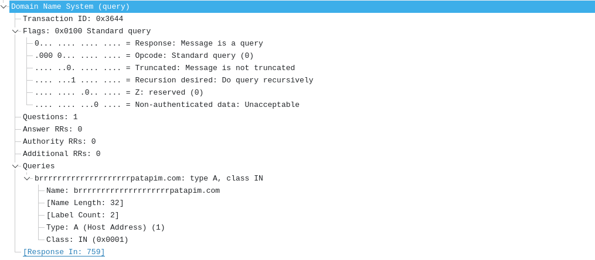
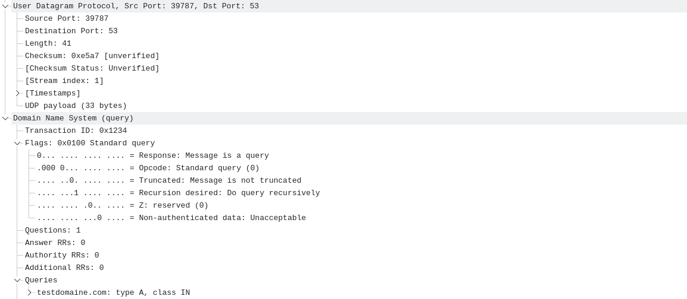

## DNS packets Anatomy
```
[Header - 12 bytes]
ID        random 16 bit number
Flags     16-bit field contenant plusieurs bits de contrôle
    QR OPCODE AA TC RD RA Z RCODE (pour une requête standard souvant 0x0100)
        QR	0 = query (pas réponse)
        OPCODE	0 = requête standard
        AA	0 (1 la réponse vient d'un serveur autoritaire / 0 réponse provenant d'un resolver/cache) (0 si requête)
        TC	0 indique que la réponse DNS a été tronquée
        RD	1 recursion desired (1=yes)
        RA	0 indique si le serveur supporte la récursion
        Z	0 toujours à 0 dans DNS classique (pour des extensions futures ; DNSSEC)
        RCODE	0 résultat de la requête. (0 = succès)

QDCOUNT   indique combien de questions sont présentes
ANCOUNT   nombre de réponse
NSCOUNT   nb de serveur d'authorité (0 dans une requête)
ARCOUNT   nombre d’enregistrements additionnels (souvant 0)

[Question]
QNAME   le nom de domaine (encodé)
QTYPE   type d'enregistrement (A=1, AAAA, TXT)
QCLASS  classe DNS (dans la majorité des cas IN (internet))
```


## DNS query in assembly

*version avec moins de commentaires : dns.asm*

```assembly
section .data
    fd dq 0

ip_packets:
    dw 2              ; AF_INET
    dw 0x3500         ; port 53
    dd 0x08080808     ; 8.8.8.8
    dq 0              ; padding

; On utilise `db` pour construire le paquet byte par byte MAIS
; Les protocoles réseau (DNS, TCP/IP, etc.) utilisent le format "network byte order" qui est en big-endian.
; Sur les CPU x86, la mémoire est en little-endian : lorsqu'on écrit un mot de 16 bits avec `dw`, les bytes sont stockés à l'envers en mémoire.
;     dw 0x1234 sera stocké en mémoire comme : 3412
;
; mais notre packet DNS doit contenir les bytes dans l'ordre.
; Pour contrôler l'ordre des bytes, on écrit explicitement chaque octet dans l'ordre voulu.
;     db 0x12,0x34 sera stocké en mémoire comme : 12 34
;
dns_query:
    db 0x12,0x34        ; ID (random 16 bit number)
    db 0x01,0x00        ; Flags (standard query RD=1, le reste à 0)
    db 0x00,0x01        ; QDCOUNT (1 car une question)
    db 0x00,0x00        ; ANCOUNT (on attend 1 réponse)
    db 0x00,0x00        ; NSCOUNT (0 dans requête)
    db 0x00,0x00        ; ARCOUNT (0)

    db 11,"testdomaine"
    db 3,"com"
    db 0

    db 0x00,0x01        ; QTYPE A
    db 0x00,0x01        ; QCLASS IN


query_len equ $-dns_query

section .text
    global _start

_start:
    ;
    mov rax, 41 ; sys_socket
    mov rdi, 2  ; domaine d’adressage AF_INET = ipv4
    mov rsi, 2  ; type de communication SOCK_DGRAM = datagrammes (UDP)
    mov rdx, 17 ; IPPROTO_UDP = 17 le protocole utilisé dans la famille
    syscall

    mov [fd], rax ; fd du sys_socket crée

    mov rax, 44 ; sys_sendto
    mov rdi, [fd] ; sys_socket
    mov rsi, dns_query ; buffer
    mov rdx, query_len ; buffer len
    xor r10, r10 ; flags = 0 (pas d’option spéciale)
    mov r8, ip_packets ; pointeur vers la structure sockaddr contenant l’adresse de destination
    mov r9, 16  ; taille de la structure sockaddr (souvent sizeof(struct sockaddr_in))
    syscall

exit:
    mov rax, 60
    xor rdi, rdi
    syscall
```

```
nasm -f elf64 dns.asm ; ld dns.o -o dns ; ./dns
```
